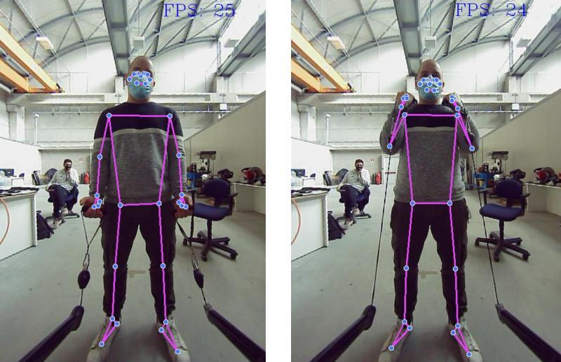

# Bernardo Lanza

Developer | Ph.D. student in mechanical and industrial engineering | Deep learning and machine vision for agriculture

    

      <h3>Contact Information</h3>
      

        
        - Email: <a href="mailto:bernardo.lanza.tech@gmail.com">bernardo.lanza.tech@gmail.com</a> 
        - <a href="https://www.linkedin.com/in/bernardo-lanza-554064163">LinkedIn</a> 
        - <a href="https://scholar.google.it/citations?user=xE5inBMAAAAJ&hl=it">Publications</a> 
        - <a href="https://github.com/bernardolanza93">Github</a>
      

    

    

      <h3>Key Competencies</h3>
      <ul>
        <li>RTK GNSS</li>
        <li>IMU</li>
        <li>SLAM</li>
      </ul>
    

    

      <h3>Languages</h3>
      
English (Full Professional)

    

    

      <h3>Certifications</h3>
      <ul>
        <li>Master degree in Mechatronic Engineering, electronics and robotics</li>
        <li>ISBS certificate</li>
        <li>DeepLearn Summer School</li>
        <li>Bachelor Degree in Industrial Engineering</li>
      </ul>
    

    

      <h3>Publications</h3>
      <ul>
        <li>STEWIE: eSTimating grapE berries number and radius from images using a Weakly supervIsed nEural network</li>
        <li>Gesture recognition for Healthcare 4.0: a machine learning approach to reduce clinical infection risks</li>
        <li>Computer vision-based mapping of grapevine vigor variability for enhanced fertilization strategies through intelligent pruning</li>
        <li>First Step Towards Embedded Vision System for Pruning Wood Estimation</li>
        <li>Deep learning for gesture recognition in sportive training operation</li>
        
      </ul>
    

    

      <h3>Experience</h3>
      <h3>ETSEA - Universitat de Lleida</h3>
      
<strong>Ph.D International Research Period</strong> April 2024 - Present Project focused on integrating low-cost RGB-D cameras with GNSS and IMU data using SLAM to create accurate 3D reconstructions of an apple orchard.

      
    
    

    

      <h3>MMTLab @ UniBS</h3>
      
<strong>Ph.D. student</strong> January 2022 - Present Collaboration with PROSPECTO to develop optical measurement techniques and data analysis methods for monitoring plant health and estimating production.

      
      
      
      
      
    

    

      <h3>Research Fellowship</h3>
      
April 2021 - February 2022 Development of an embedded vision system using deep neural networks for crop and weed recognition in collaboration with Ferrari Costruzioni Meccaniche.

         
     

    

      <h3>University of Brescia</h3>
      
<strong>Adjunct Professor</strong> September 2023 - Present Teaching Vision Systems for Mechatronics.

      
<strong>Adjunct Professor</strong> September 2021 - Present Teaching Robotics and Measurements - Industrial Measurements Laboratory.

    

    

      <h3>University of Trento</h3>
      
<strong>Physics 1 Lab Tutor</strong> October 2019 - April 2021

      
<strong>Master Thesis Project</strong> March 2020 - November 2020 Development of a localization system (SLAM) using INTEL RealSense D435 and T265 optical sensors.

      
<strong>Physics Tutor</strong> February 2019 - September 2019

    

    

      <h3>Prospecto Srl</h3>
      
<strong>Junior Developer</strong> January 2023 - June 2024

    

    

      <h3>Projects</h3>
      <h4>Gesture Recognition for Healthcare 4.0</h4>
      
<strong>September 2022 - June 2023</strong> Associated with MMTLab @ UniBS

      
Gesture recognition for Healthcare 4.0: a machine learning approach to reduce clinical infection risks. In collaboration with Idea-Re S.r.l., we created a vision-based system to detect hands and recognize gestures for monitoring surgical handwashing procedures, essential for infection control. We also deployed machine learning algorithms to analyze the data collected by the system.

      
Skills: Machine learning, Python, Biomechanics, Deep Learning

      
Publication: 2023 IEEE International Workshop on Metrology for Industry 4.0 and IoT

         
         

      
      <h4>Vision System for Body and Gym Gesture Recognition</h4>
      
<strong>April 2021 - April 2022</strong> Associated with MMTLab @ UniBS

      
In collaboration with ABHorizon, this project involves developing a vision-based pose estimator for human body and gym gesture recognition.

      
Skills: OpenCV, Statistics, TCP/IP, Python, Deep Learning

      
Publication: International Society of Biomechanics in Sports

      
      

      <h4>Vision Embedded System for Crop and Weed Recognition</h4>
      
<strong>August 2021 - February 2022</strong> Associated with MMTLab @ UniBS

      
In collaboration with Ferrari Costruzioni Meccaniche, we're developing a vision-based embedded system, utilizing deep neural networks, for crop and weed recognition.

      
Skills: Embedded Linux, Python, Computer Vision, Engineering, Research & Development

      
    

    

      <h3>Awards</h3>
      
2023 Best Poster Award at the IEEE International Workshop on Metrology for Agriculture and Forestry for the poster "FIRST STEP TOWARDS EMBEDDED VISION SYSTEM FOR PRUNING WOOD ESTIMATION."

      
      
    

    

      <h3>For any inquiries, please contact me!</h3>
      
    

