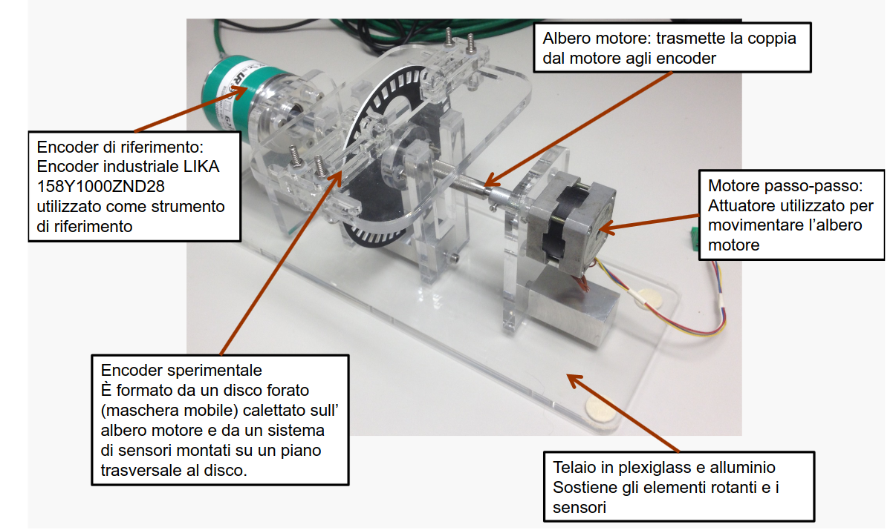

<body>
  

  <!-- Your existing content -->
</body>

  <h1>Portfolio</h1>
  
Developer | Ph.D. student in mechanical and industrial engineering | Deep learning and machine vision for agriculture

    

      <h3>Contact Information</h3>
      

      

        - Email: <a href="mailto:bernardo.lanza.tech@gmail.com">bernardo.lanza.tech@gmail.com</a> 
        - <a href="https://www.linkedin.com/in/bernardo-lanza-554064163">LinkedIn</a> 
        - <a href="https://scholar.google.it/citations?user=xE5inBMAAAAJ&hl=it">Publications</a> 
        - <a href="https://github.com/bernardolanza93">Github</a>
      

    

    

      <h2>Resume</h2>
      Hey there! I m Bernardo, the tech wizard who turns orchards into high-tech havens using AI and computer vision. Armed with a Ph.D. and a passion for mechatronics, I blend robotics and nature like no other. When I m not revolutionizing agriculture, you can find me diving into history, tinkering with DIY IoT gadgets, or volunteering for community causes. Let’s team up and create the future together!
      

    

    

      <h3>Awards</h3>
      
2023 Best Poster Award at the IEEE International Workshop on Metrology for Agriculture and Forestry for the poster "FIRST STEP TOWARDS EMBEDDED VISION SYSTEM FOR PRUNING WOOD ESTIMATION."

      
      <figcaption>Conference cerimony</figcaption>
      
      <figcaption>Poster award</figcaption>
      
      <figcaption>Poster</figcaption>

    

    

      <h3>Key Competencies</h3>
      <ul>
        <li>RTK GNSS</li>
        <li>IMU</li>
        <li>SLAM</li>
      </ul>
    

    

      <h3>Languages</h3>
      
Italian (native speaker)

      
English (Full Professional)

    

    

      <h2>Certifications</h2>
      
        <h3>Ph.D in Mechanical and industrial engineering: Optical-based measurement for plant monitoring and yield estimation.</h3>
        
        <h3>DeepLearn Summer School</h3>

    

    

      <h3>Publications</h3>
      <ul>
        <li>STEWIE: eSTimating grapE berries number and radius from images using a Weakly supervIsed nEural network</li>
        <li>Gesture recognition for Healthcare 4.0: a machine learning approach to reduce clinical infection risks</li>
        <li>Computer vision-based mapping of grapevine vigor variability for enhanced fertilization strategies through intelligent pruning</li>
        <li>First Step Towards Embedded Vision System for Pruning Wood Estimation</li>
        <li>Deep learning for gesture recognition in sportive training operation</li>
        <li>...</li>

        <li> <a href="https://scholar.google.it/citations?user=xE5inBMAAAAJ&hl=it">Other Publications</a>  </li>

        
      </ul>
    

    

      <h3>Experience</h3>
      <h3>ETSEA - Universitat de Lleida</h3>
      
<strong>Ph.D International Research Period</strong> April 2024 - Present Project focused on integrating low-cost RGB-D cameras with GNSS and IMU data using SLAM to create accurate 3D reconstructions of an apple orchard.

      
      <figcaption>Aquisition system: A)Intel Realsense D455f. B) ZED-x mini. C)Kinect Azure DK. D) Livox Mid-70 LiDAR. E) Nvidia Jetson Orin. </figcaption>
      
      <figcaption>Single Kinect raw pointcloud - harsh environment - low quality input </figcaption>
      
      <figcaption>Succesful 3D reconstruction with novel custom SLAM algorithm</figcaption>
      
      <figcaption>Aquisition scooter: 1)RTK GNSS + ESP32 module. 2) Optical Sensors. 3) Livox Mid-70 LiDAR + Xsens MTi-630 IMU.  4) Scooter.</figcaption>

    

    

      <h3>Prospecto Srl - Ph.D. industrial Stage </h3>
      
<strong>Junior Developer</strong> January 2023 - January 2024

    

    

      <h3>MMTLab @ UniBS</h3>
      
<strong>Ph.D. student</strong> January 2022 - Present Collaboration with PROSPECTO to develop optical measurement techniques and data analysis methods for monitoring plant health and estimating production.

      
      
      <figcaption>Aquisition system: A) Intel RealSense D435i. B) Intel RealSense T265 VO. C) Basler RGB DART camera (model daA2500-14uc) D) Nvidia Jetson Nano </figcaption>
    
      
      <figcaption>Neural network for buds detection and tracking</figcaption>
    
      
      <figcaption>Neural network for branch segmentation</figcaption>
    
      
      <figcaption>Measurments model: series of varying diameter cylinder</figcaption>
    
      
      <figcaption>Experimental campaign</figcaption>
    
      
      <figcaption>Real-time DETECTION, TRACKING AND COUNTING</figcaption>
    
      
      <figcaption>3D estimation of branch</figcaption>
    
      
      <figcaption>Results of volume estimation</figcaption>
    
      
      <figcaption>Processing pipeline</figcaption>
    

    

      <h3>Research Fellowship</h3>
      
April 2021 - February 2022 Development of an embedded vision system using deep neural networks for crop and weed recognition.

         
      <figcaption>Intelligent segmentation</figcaption>

    

    

      <h3>Projects</h3>
      <h4>Gesture Recognition for Healthcare 4.0</h4>
      
<strong>September 2022 - June 2023</strong> Associated with MMTLab @ UniBS

      
Gesture recognition for Healthcare 4.0: a machine learning approach to reduce clinical infection risks. In collaboration with Idea-Re S.r.l., we created a vision-based system to detect hands and recognize gestures for monitoring surgical handwashing procedures, essential for infection control. We also deployed machine learning algorithms to analyze the data collected by the system.

      
Skills: Machine learning, Python, Biomechanics, Deep Learning

      
Publication: 2023 IEEE International Workshop on Metrology for Industry 4.0 and IoT

        
      <figcaption>Hand Pose</figcaption>

         
      <figcaption>Mediapipe</figcaption>

      
      <h4>Vision System for Body and Gym Gesture Recognition</h4>
      
<strong>April 2021 - April 2022</strong> Associated with MMTLab @ UniBS

      
In collaboration with ABHorizon, this project involves developing a vision-based pose estimator for human body and gym gesture recognition.

      
Skills: OpenCV, Statistics, TCP/IP, Python, Deep Learning

      
Publication: International Society of Biomechanics in Sports

      
<a href="https://techxplore.com/news/2022-09-deep-learning-augmented-smart-mirror.html>Read the Online Feature Interview!</a>

      
      <figcaption>ISBS Conference</figcaption>

      
      <figcaption>Smart mirror</figcaption>

      <h4>Vision Embedded System for Crop and Weed Recognition</h4>
      
<strong>August 2021 - February 2022</strong> Associated with MMTLab @ UniBS

      
In collaboration with Ferrari Costruzioni Meccaniche, we're developing a vision-based embedded system, utilizing deep neural networks, for crop and weed recognition.

      
Skills: Embedded Linux, Python, Computer Vision, Engineering, Research & Development

      
      <figcaption>Preneural Visual Detector</figcaption>
    

    

      <h3>University of Brescia</h3>
      
<strong>Adjunct Professor</strong> September 2023 - Present Teaching Vision Systems for Mechatronics.

      
<strong>Adjunct Professor</strong> September 2021 - Present Teaching Robotics and Measurements - Industrial Measurements Laboratory.

      
<strong>Lecturer</strong> November 2023    “Probabilistic Sensor Fusion: From Naïve Bayes to Kalman Filters: Lab. of Mechanical and Thermal Measurements

      
Didactics Design, Matlab, Predictive Maintenance, Statistics, Modal Analysis, Metrology, Autonomous Navigation, Dynamics

    

    

      <h3>University of Trento</h3>
      

      
<strong>Master Thesis Project</strong> March 2020 - November 2020 Development of a localization system (SLAM) using INTEL RealSense D435 and T265 optical sensors.

      <h3>Master degree in Mechatronic Engineering, electronics and robotics</h3>
      
      <figcaption>M.S. thesis: sensor fusion based localization with Apriltag and odometric data</figcaption>
      
      
<strong>Physics - Mechanics Lab Tutor</strong> October 2019 - April 2021

      
<strong>Physics Tutor (Cinematics, Dynamics, and Electromagnetism) </strong> February 2019 - September 2019

      <h3>Bachelor Degree in Industrial Engineering</h3>
      
      <figcaption>B.S. thesis: Design and implementation of custom optical encoder vs professional encoders</figcaption>

      
    

    

      <h3>For any inquiries, please contact me!</h3>
      
    

